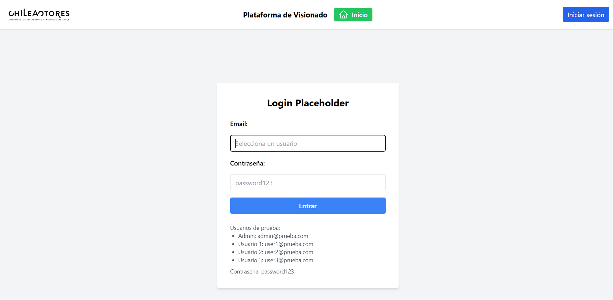
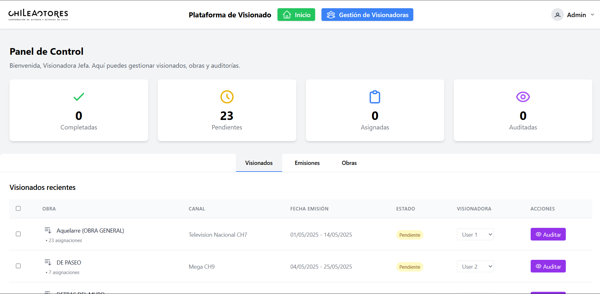
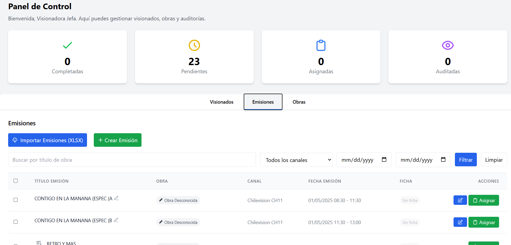
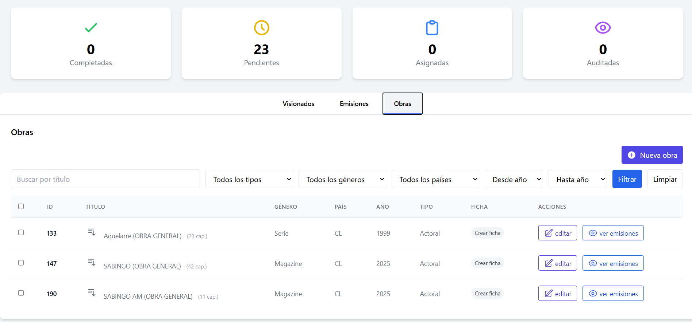
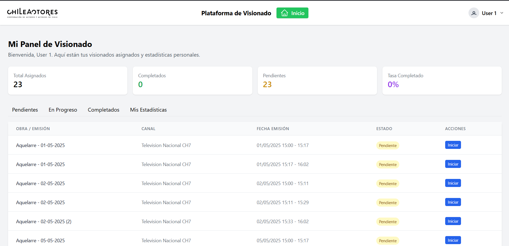
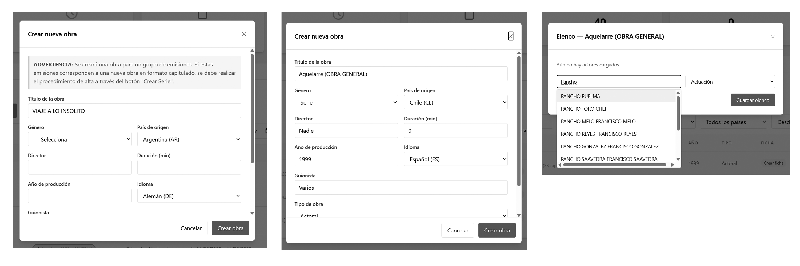
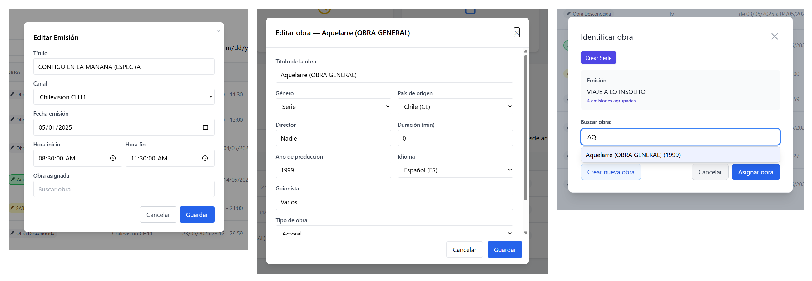
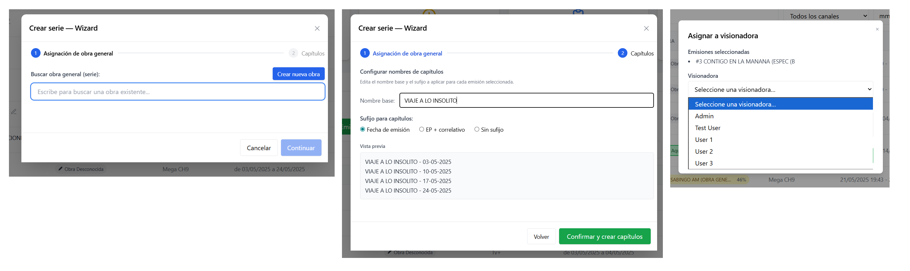

# Visionado

Web platform for managing audiovisual content review workflows.

The system allows administrators to import broadcast schedules, manage productions and episodes, assign reviewers, and track review progress through a centralized dashboard.

## Features

- Bulk XLSX import with automatic validation
- Production and episode management
- Automatic title matching suggestions
- Role-based access control
- Interactive dashboards
- Advanced filtering and search

## Screenshots

### Dashboard & Login

 

### Modals

## Requirements

- PHP >= 8.2
- Composer
- Node.js & NPM
- MySQL/MariaDB
- PHP Extensions: zip, xml, mbstring, pdo_mysql

## Installation

### 1. Clone the repository
git clone https://github.com/diosses/visionado.git
cd visionado

### 2. Install dependencies
composer install
npm install

### 3. Configure the environment
cp .env.example .env
php artisan key:generate

### 4. Configure the database
#### Edit the .env file with your database credentials:
DB_CONNECTION=mysql
DB_HOST=127.0.0.1
DB_PORT=3306
DB_DATABASE=visionado
DB_USERNAME=your_username
DB_PASSWORD=your_password

### 5. Run migrations and seeders:
php artisan migrate --seed

### 6. Build assets
npm run build

### 7. Start the development server
php artisan serve

The application will be available at http://localhost:8000

## Usage

### XLSX Import (Broadcasts)

1. Access the Dashboard as an administrator
2. Go to the “Unassigned Material” tab
3. Click on “Import Broadcasts (XLSX)”
4. Upload a file with the required structure:
   - **“Summary” sheet**: Rows where the “Reviewed” field equals “TO BE REVIEWED”
   - **“Programs” sheet**: Broadcast data matching the Summary sheet

### Work Assignment

- Unassigned material is grouped by “Broadcast Title”
- You can assign existing works or quickly create new ones
- Assignments generate review items in a pending state
- Reviewers can start their work from their dashboard

### Work Management

- Full catalog with filters by type, genre, country, and year
- Series support with season and episode management
- Detailed metadata including cast and technical information

## Project Structure

app/
├── Http/Controllers/    # Application controllers
├── Models/             # Eloquent models
├── Imports/            # Excel import classes
└── Services/           # Business logic services

database/
├── migrations/         # Database migrations
└── seeders/            # Seed data

resources/
├── views/              # Blade templates
├── js/                 # JavaScript modules
└── css/                # Tailwind styles

## Technologies

- Backend: Laravel 11, PHP 8.2
- Frontend: Blade, Alpine.js, Tailwind CSS
- Database: MySQL
- Import: Maatwebsite Excel (PhpSpreadsheet)
- Build Tools: Vite

## Additional Documentation

For more details about workflow and platform usage, see README_ES.md

## Author

Developed by [diosses](https://github.com/diosses)
